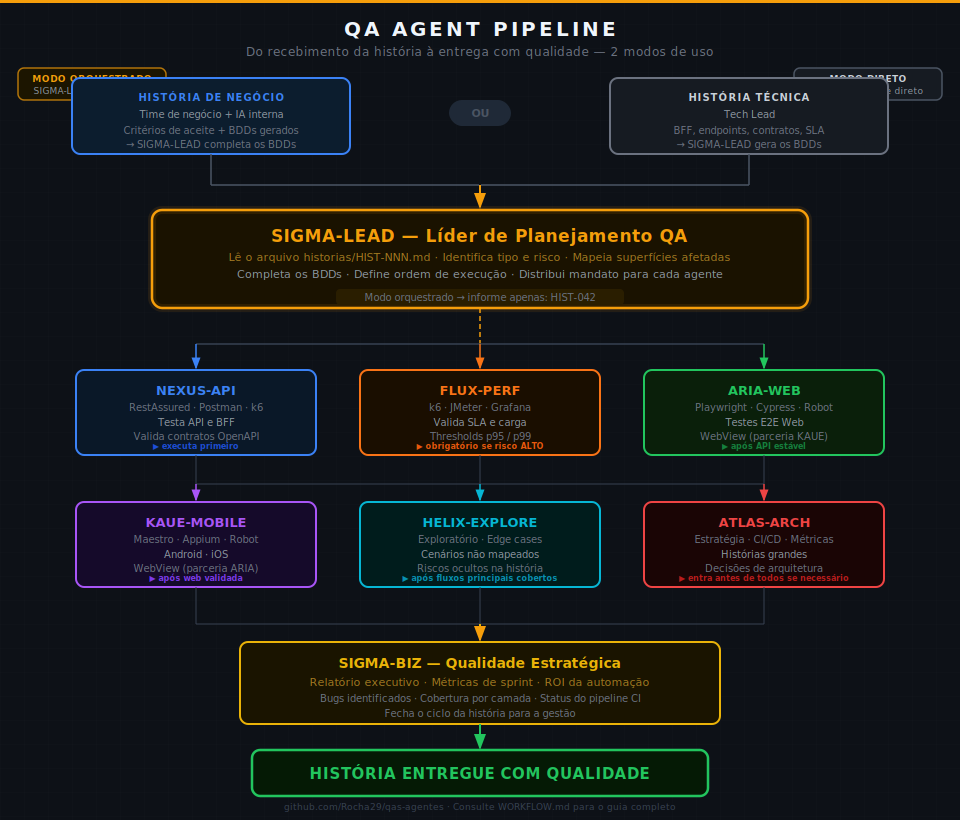

# QA Agents — Time de Agentes Especializados em Qualidade de Software

<p align="center">
  
</p>

Base de conhecimento e system prompts para **8 agentes QA especializados**, construídos sobre o conteúdo de referências brasileiras de qualidade de software e validados em uma POC completa com automação Web, API e Performance.

---

## O Time de Agentes

| Agente | Área | Arquivo | Tecnologias principais |
|--------|------|---------|----------------------|
| **SIGMA-LEAD** | Líder de Planejamento QA | `agents/SIGMA-LEAD.md` | Orquestra o time, lê histórias, monta o Plano de Sprint QA |
| **ARIA-WEB** | Automação Web & WebView | `agents/ARIA-WEB.md` | Playwright, Cypress, Robot Framework |
| **KAUE-MOBILE** | Automação Mobile & WebView | `agents/KAUE-MOBILE.md` | Maestro, Appium, Robot Framework AppiumLibrary |
| **NEXUS-API** | Testes de API & BFF | `agents/NEXUS-API.md` | RestAssured, Postman, k6 |
| **FLUX-PERF** | Performance & Observabilidade | `agents/FLUX-PERF.md` | k6, JMeter, Grafana |
| **ATLAS-ARCH** | Arquitetura de Qualidade | `agents/ATLAS-ARCH.md` | Estratégia, CI/CD, métricas |
| **HELIX-EXPLORE** | Exploratório & Tendências | `agents/HELIX-EXPLORE.md` | IA aplicada, testing emergente |
| **SIGMA-BIZ** | Negócios & Qualidade Estratégica | `agents/SIGMA-BIZ.md` | Relatórios executivos, OKRs de QA |

---

## Fluxo de Trabalho

<p align="center">
  
</p>

> O fluxo completo está documentado em [`WORKFLOW.md`](WORKFLOW.md) — modos orquestrado e direto, parceria WebView, templates de história.

---

## Como Usar os Agentes

### Claude Code (CLI)

```bash
# Ativar um agente em qualquer projeto existente
claude --system-prompt /caminho/para/qa-agents/agents/ARIA.md

# Exemplo real dentro do seu projeto
claude --system-prompt ~/qa-agents/agents/NEXUS.md "Revise os testes de API deste projeto"
```

---

### GitHub Copilot — receita de bolo

**Funciona em:** VS Code, JetBrains, Visual Studio, GitHub.com, GitHub Mobile.

**Passo a passo:**

1. No projeto onde você quer o agente, crie a pasta `.github/` se não existir
2. Crie o arquivo `.github/copilot-instructions.md`
3. Cole o conteúdo do agente desejado (ex: `agents/ARIA.md`) nesse arquivo
4. Pronto — o Copilot Chat vai seguir o persona em todas as conversas do repo

```bash
# Exemplo: ativar ARIA (Web) em um projeto existente
mkdir -p meu-projeto/.github
cp ~/qa-agents/agents/ARIA.md meu-projeto/.github/copilot-instructions.md
```

**Dica importante:** O Copilot Code Review lê apenas os primeiros **4.000 caracteres** do arquivo. Se o prompt do agente for longo, coloque as instruções mais críticas no topo.

O arquivo `.github/copilot-instructions.md` é enviado automaticamente em toda mensagem do Copilot Chat — funciona como um system prompt persistente para o repositório.

---

### Devin (Cognition AI) — receita de bolo

> Não existe um "Devin CLI" oficial. O mecanismo correto é via **Playbook** (para tarefas repetidas) ou **Knowledge** (para contexto permanente de repo).

#### Opção 1 — Playbook (recomendado para tarefas QA específicas)

1. Acesse [preview.devin.ai](https://preview.devin.ai) → **Playbooks** → **New Playbook**
2. Cole o conteúdo do agente desejado (ex: `agents/FLUX.md`) no campo de instruções
3. Dê um nome (ex: `QA Performance — FLUX`) e salve
4. Na hora de usar: no prompt box, digite `!` e selecione o Playbook

**Alternativa rápida:** salve o conteúdo do agente como `flux-playbook.md` e arraste o arquivo para o chat do Devin ao iniciar uma sessão.

#### Opção 2 — Knowledge (contexto permanente por repo)

1. Acesse **Knowledge** → **New Knowledge**
2. Cole o conteúdo do agente
3. Em **Scope**, selecione o repositório específico onde quer que o agente seja sempre injetado
4. Salve — o Devin vai usar esse contexto automaticamente em todas as sessões daquele repo

---

### Qual agente usar em cada situação?

| Situação | Agente recomendado |
|----------|--------------------|
| Escrever/revisar testes E2E Web | ARIA |
| Testar APIs REST / contratos | NEXUS |
| Testes mobile (Android/iOS) | KAUÊ |
| Performance e carga | FLUX |
| Definir estratégia de QA | ATLAS |
| Exploratório, edge cases | HELIX |
| Relatório executivo / métricas | SIGMA |

Consulte `USAGE.md` para a matriz completa de decisão e checklists de validação por agente.

---

## VS Code — Extensões para usar os Agentes

> Nenhuma dessas extensões é obrigatória para usar o projeto. Os agentes funcionam com qualquer ferramenta que aceite um system prompt — Claude Code CLI, Copilot, Continue, Cline ou até colando o `.md` direto no chat. As sugestões abaixo são para quem quer uma experiência mais integrada dentro do VS Code.

---

### Extensões recomendadas

#### GitHub Copilot + Copilot Chat
**IDs:** `GitHub.copilot` e `GitHub.copilot-chat`
**Publisher:** Microsoft/GitHub — oficial e auditado.

**O que você ganha:** o Copilot passa a responder no persona do agente em todas as conversas do repositório, sem precisar colar o prompt manualmente toda vez.

**Como funciona no dia a dia deste projeto:**
```bash
# Uma vez por projeto — ativa o agente desejado
mkdir -p .github
cp ~/qa-agents/agents/ARIA-WEB.md .github/copilot-instructions.md
```
A partir daí o Copilot Chat daquele repo já responde como ARIA-WEB. Para trocar de agente, basta substituir o arquivo. Nenhuma outra configuração necessária.

> Dica: o Copilot Code Review lê apenas os primeiros **4.000 caracteres** do arquivo. Coloque as instruções mais críticas no topo do prompt.

---

#### Continue
**ID:** `Continue.continue`
**Publisher:** Continue Dev — open source, código auditável no GitHub.

**O que você ganha:** cria um perfil por agente no VS Code e troca entre eles pelo seletor de modelo, sem mexer em arquivos. Funciona com Claude API, OpenAI, modelos locais (Ollama) — você escolhe.

**Como funciona no dia a dia deste projeto:**
Edite `~/.continue/config.json` e crie um perfil para cada agente que usa com frequência:

```json
{
  "models": [
    {
      "title": "SIGMA-LEAD — Planejamento QA",
      "provider": "anthropic",
      "model": "claude-sonnet-4-6",
      "apiKey": "sua-chave-aqui",
      "systemMessage": "<cole o conteúdo de agents/SIGMA-LEAD.md>"
    },
    {
      "title": "NEXUS-API — Testes de API",
      "provider": "anthropic",
      "model": "claude-sonnet-4-6",
      "apiKey": "sua-chave-aqui",
      "systemMessage": "<cole o conteúdo de agents/NEXUS-API.md>"
    }
  ]
}
```

No chat do VS Code, você troca de agente pelo dropdown — sem copiar arquivo nenhum.

---

#### Cline
**ID:** `saoudrizwan.claude-dev`
**Publisher:** open source, amplamente adotado na comunidade.

**O que você ganha:** o agente não só conversa — ele lê arquivos do projeto, edita código e executa comandos no terminal de forma autônoma. Útil para pedir que NEXUS-API escreva e já salve os testes no projeto.

**Como funciona no dia a dia deste projeto:**
1. Abra as configurações do Cline (`Ctrl+,` → busque "Cline")
2. Cole o conteúdo do agente desejado em **Custom Instructions**
3. Selecione o modelo `claude-sonnet-4-6`

> **Atenção:** o Cline acessa o sistema de arquivos e executa comandos no terminal por design. Revise as ações que ele propõe antes de aprovar, especialmente em projetos de produção.

---

#### GitLens
**ID:** `eamodio.gitlens`
**Publisher:** GitKraken — empresa estabelecida, extensão com mais de 30 milhões de instalações.

**O que você ganha:** visibilidade de histórico e autoria diretamente no editor — essencial para QA investigar quando e por quem uma linha foi alterada, comparar branches antes de testar, e entender o contexto de um bug.

**Como funciona no dia a dia deste projeto:**
Sem configuração — instale e use. As anotações de blame aparecem inline ao lado do código. O histórico de arquivo (`Alt+H`) mostra todas as alterações com diff. Útil ao revisar mudanças antes de escrever os casos de teste.

---

#### Playwright Test for VS Code
**ID:** `ms-playwright.playwright`
**Publisher:** Microsoft — oficial.

**O que você ganha:** roda e depura os testes do `lojinha-tests/` diretamente pelo painel lateral do VS Code, com ponto de parada visual e gravação de ações no browser.

**Como funciona no dia a dia deste projeto:**
Abra a pasta `lojinha-tests/` no VS Code — a extensão detecta o `playwright.config.ts` automaticamente e lista todos os testes no painel "Testing". Clique em qualquer teste para rodar ou depurar sem precisar do terminal.

---

#### Extension Pack for Java
**ID:** `vscjava.vscode-java-pack`
**Publisher:** Microsoft — oficial.

**O que você ganha:** suporte completo a Java no VS Code — autocomplete, diagnóstico, runner de testes JUnit, integração com Gradle.

**Como funciona no dia a dia deste projeto:**
Necessário para trabalhar no projeto `lojinha-api-tests/` (RestAssured + Java 17 + Gradle). Com a extensão instalada, os testes JUnit aparecem no painel "Testing" e podem ser rodados com um clique, igual ao Playwright.

---

#### Robot Framework LSP
**ID:** `robocorp.robotframework-lsp`
**Publisher:** Robocorp — empresa com foco em automação, extensão mantida ativamente.

**O que você ganha:** autocomplete de keywords, navegação para definições e diagnóstico de erros em arquivos `.robot` — sem essa extensão, editar Robot Framework no VS Code é editar texto sem nenhum auxílio.

**Como funciona no dia a dia deste projeto:**
Necessário para trabalhar em `mobile/android/robot/`. Instale e abra qualquer arquivo `.robot` — autocomplete e erros aparecem automaticamente.

---

### Workspace settings por projeto

Salve as preferências de agente por projeto criando `.vscode/settings.json` na raiz do seu projeto:

```json
{
  "github.copilot.chat.codeGeneration.useInstructionFiles": true,
  "continue.defaultModel": "NEXUS-API — Testes de API"
}
```

Assim cada repositório abre com o agente certo sem reconfigurar nada.

---

## Fontes de Conhecimento

Os prompts dos agentes são fundamentados no conteúdo de cinco referências brasileiras de QA:

### Júlio de Lima
- Estratégia de testes, API REST (RestAssured + Java), Postman, BDD/Cucumber, Performance com JMeter, IA aplicada a testes
- YouTube: `@JuliodeLimas` | Site: juliodelima.com.br

### Fernando Papito
- Playwright, Cypress, Robot Framework, CI/CD, Page Objects, Feature Actions, arquitetura de frameworks, fintechs
- YouTube: Fernando Papito | Site: fernandopapito.com

### QAzando
- Automação mobile (iFood, IBM, Banco Neon), automação web, API, gestão de equipes QA, diversidade de stacks
- YouTube: QAzando | Site: qazando.com.br

### Vinícius Pessoni
- Java + RestAssured + JUnit 5 + Gradle (níveis jr/pl/sr), CTFL, liderança técnica, carreira internacional
- YouTube: pessonizando | GitHub: github.com/vinnypessoni

### Walmyr (Talking About Testing)
- Cypress, Playwright, práticas modernas de automação, cultura de qualidade, conteúdo em português e inglês
- YouTube: Talking About Testing | Site: talkingabouttesting.com

---

## Estrutura do Repositório

```
qa-agents/
├── agents/                        # System prompts dos 7 agentes
│   ├── ARIA.md
│   ├── KAUE.md
│   ├── NEXUS.md
│   ├── FLUX.md
│   ├── ATLAS.md
│   ├── HELIX.md
│   └── SIGMA.md
│
├── knowledge_base/                # Base de conhecimento por autor
│   ├── julio-de-lima/
│   ├── fernando-papito/
│   ├── qazando/
│   ├── vinicius-pessoni/
│   ├── walmyr-talkingabouttesting/
│   └── lojinha/                   # Contexto da aplicação de referência
│
├── lojinha-tests/                 # Testes E2E Web — Playwright + TypeScript
│   ├── pages/                     # Page Objects
│   ├── tests/                     # Specs
│   ├── playwright.config.ts
│   └── package.json
│
├── lojinha-api-tests/             # Testes de API — RestAssured + Java 17 + JUnit 5
│   ├── src/test/java/
│   ├── build.gradle
│   └── gradlew
│
├── lojinha-performance/
│   ├── k6/                        # Scripts de performance k6
│   │   ├── smoke.js
│   │   ├── stress.js
│   │   ├── login-load.js
│   │   └── produtos-load.js
│   └── jmeter/                    # Planos de teste JMeter (.jmx)
│
├── mobile/
│   └── android/
│       ├── maestro/flows/         # Flows YAML para Maestro
│       └── robot/                 # Robot Framework + AppiumLibrary
│
├── reports/                       # Relatórios da POC
├── USAGE.md                       # Matriz de decisão e checklists
└── CLAUDE.md                      # Instruções para o Claude Code
```

---

## Pré-requisitos

| Ferramenta | Versão mínima | Usado em |
|------------|--------------|----------|
| Node.js | 18+ | lojinha-tests (Playwright) |
| Java JDK | 17 | lojinha-api-tests (Gradle) |
| k6 | latest | lojinha-performance/k6 |
| JMeter | 5.6+ | lojinha-performance/jmeter |
| Python | 3.9+ | mobile/android/robot |
| Appium | 2.x | mobile/android/robot |
| Maestro CLI | latest | mobile/android/maestro |
| Android SDK / emulador | API 30+ | mobile (ambos) |

---

## Como Rodar os Projetos

### lojinha-tests — Playwright (Web E2E)

```bash
cd lojinha-tests
npm install
npx playwright install chromium

# Rodar todos os testes
npx playwright test

# Rodar com UI interativa
npx playwright test --ui

# Gerar relatório HTML
npx playwright show-report
```

### lojinha-api-tests — RestAssured + Java 17

```bash
cd lojinha-api-tests

# Rodar todos os testes
./gradlew test

# Relatório HTML gerado em:
# build/reports/tests/test/index.html
```

### lojinha-performance/k6

```bash
cd lojinha-performance/k6

# Smoke test (verificação rápida)
k6 run smoke.js

# Load test — login
k6 run login-load.js

# Load test — produtos
k6 run produtos-load.js

# Stress test
k6 run stress.js
```

### lojinha-performance/jmeter

```bash
cd lojinha-performance/jmeter

# Rodar via script (requer JMETER_HOME configurado)
chmod +x run.sh
./run.sh

# Ou diretamente com JMeter CLI
jmeter -n -t lojinha-smoke.jmx -l results/smoke.jtl -e -o results/report
```

### mobile/android/maestro

```bash
# Instalar Maestro CLI
curl -Ls "https://get.maestro.mobile.dev" | bash

# Iniciar emulador Android e instalar o APK antes de rodar

# Rodar um flow específico
maestro test mobile/android/maestro/flows/login.yaml

# Rodar todos os flows
maestro test mobile/android/maestro/flows/
```

### mobile/android/robot — Robot Framework + AppiumLibrary

```bash
cd mobile/android/robot

# Instalar dependências Python
pip install robotframework robotframework-appiumlibrary

# Iniciar o servidor Appium antes de rodar
appium

# Rodar os testes
robot tests/login_tests.robot
robot tests/

# Resultados gerados em results/
```

---

## Resultados da POC

A POC demonstrou automação ponta a ponta com três agentes (ARIA, NEXUS, FLUX) em uma única sessão:

| Camada | Tecnologia | Testes | Resultado |
|--------|-----------|--------|-----------|
| Web E2E | Playwright + TypeScript | 17 | 17/17 passando |
| API | RestAssured + Java 17 | 17 | 17/17 passando |
| Performance | k6 + JMeter | 2 suítes | 1 verde / 1 com alerta de SLA |

Relatório executivo completo: `reports/relatorio-poc-final.md`

---

## Contribuindo

1. Cada agente tem seu prompt em `agents/<NOME>.md`
2. Material de referência vai em `knowledge_base/<autor>/`
3. Novos projetos de teste seguem a estrutura existente por camada
4. Consulte `CLAUDE.md` antes de trabalhar no repo com Claude Code
